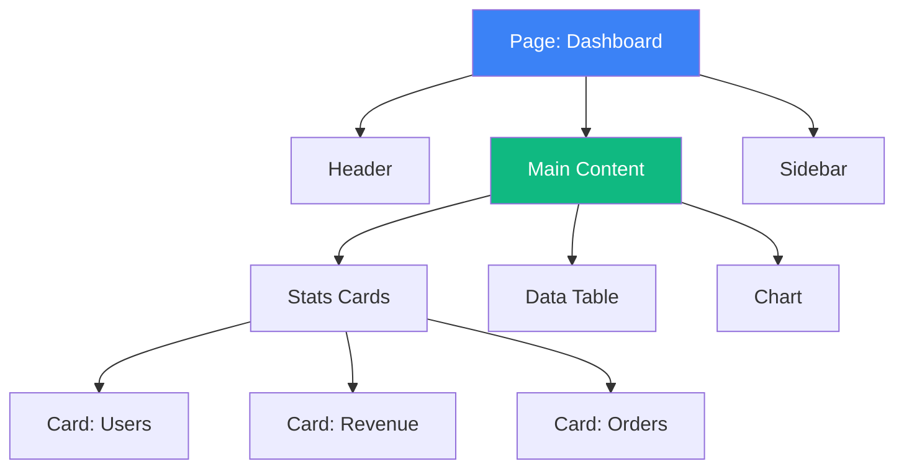
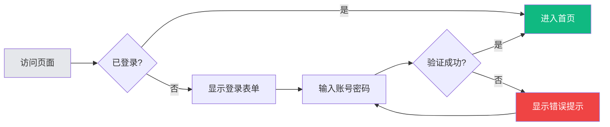
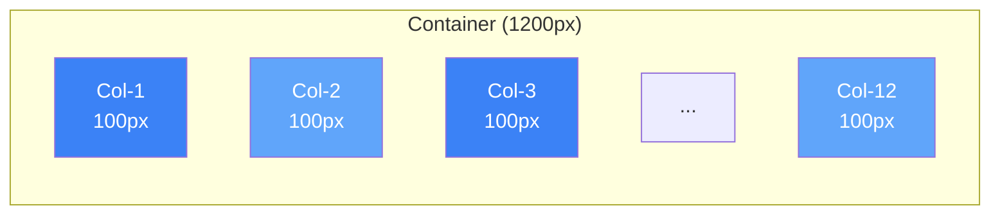

# 画布空间使用指南

## 概述

画布（Canvas）是UI Agent Workspace的可视化设计空间，使用Markdown原生支持的各种方式绘制UI原型、布局图和组件示例。

## 画布文件位置

```
canvas/
├── overview.md           # 项目总览画布
├── pages/               # 页面级画布
│   ├── home.md
│   ├── dashboard.md
│   └── settings.md
├── components/          # 组件级画布
│   ├── button.md
│   ├── card.md
│   └── modal.md
└── layouts/             # 布局模板
    ├── grid-system.md
    └── responsive.md
```

## 画布文件结构

```markdown
# {画布标题}

## 元信息
- **类型**: page | component | layout | overview
- **状态**: draft | design | review | final
- **版本**: 1.0
- **更新**: 2026-02-16

## 设计概述
[简短描述设计目标和关键特征]

## 视觉设计
[图形化展示]

## 规格说明
[尺寸、颜色、间距等详细规格]

## 交互说明
[交互行为和状态变化]

## 实现参考
[链接到代码实现]
```

## 绘制方式

### 1. ASCII 艺术

适用于简单组件和快速草图。

#### 基础按钮

```markdown
### 默认状态
```
┌─────────────────────────────┐
│                             │
│      ┌──────────────┐       │
│      │    提交      │       │
│      └──────────────┘       │
│                             │
└─────────────────────────────┘
```
```

#### 带状态的按钮

```markdown
### 按钮状态

**默认**:
```
┌─────────────────┐
│     提交        │  bg: #3B82F6, text: white
└─────────────────┘
```

**悬停**:
```
┌─────────────────┐
│     提交        │  bg: #2563EB, shadow: sm
└─────────────────┘
```

**禁用**:
```
┌─────────────────┐
│     提交        │  bg: #9CA3AF, cursor: not-allowed
└─────────────────┘
```
```

#### 页面布局

```markdown
### 首页布局

```
┌─────────────────────────────────────────────────────────────┐
│  LOGO                                    首页  产品  关于    │  ← Header (64px)
├─────────────────────────────────────────────────────────────┤
│                                                             │
│  ┌─────────────────────────────────────────────────────┐   │
│  │                                                     │   │
│  │              Hero Section (400px)                   │   │
│  │                                                     │   │
│  │         [标题]                                      │   │
│  │         [副标题]                                    │   │
│  │         [  立即开始  ]                              │   │
│  │                                                     │   │
│  └─────────────────────────────────────────────────────┘   │
│                                                             │
│  ┌─────────────┐  ┌─────────────┐  ┌─────────────┐        │
│  │   特性1     │  │   特性2     │  │   特性3     │        │  ← Features
│  │   [icon]    │  │   [icon]    │  │   [icon]    │        │
│  │   描述...   │  │   描述...   │  │   描述...   │        │
│  └─────────────┘  └─────────────┘  └─────────────┘        │
│                                                             │
├─────────────────────────────────────────────────────────────┤
│                      页脚信息                               │  ← Footer
└─────────────────────────────────────────────────────────────┘
```
```

### 2. Mermaid 图表

适用于流程图、架构图和复杂布局。

#### 组件层级

```markdown
### 组件结构


```

#### 用户流程

```markdown
### 登录流程


```

#### 布局网格

```markdown
### 12列网格系统


```

### 3. 表格规格

适用于详细的设计规范。

```markdown
### 设计规格

| 属性 | 值 | 说明 |
|------|-----|------|
| 宽度 | 120px | 固定宽度 |
| 高度 | 40px | 固定高度 |
| 背景色 | #3B82F6 | 主色调 |
| 文字颜色 | #FFFFFF | 白色 |
| 字体大小 | 14px | 正文尺寸 |
| 圆角 | 8px | 中等圆角 |
| 内边距 | 0 16px | 水平内边距 |
| 阴影 | 0 2px 4px rgba(0,0,0,0.1) | 轻微阴影 |

### 间距系统

| Token | 值 | 使用场景 |
|-------|-----|----------|
| space-1 | 4px | 图标与文字间距 |
| space-2 | 8px | 紧凑组件内边距 |
| space-3 | 12px | 标准间距 |
| space-4 | 16px | 组件间距 |
| space-5 | 24px | 区块间距 |
| space-6 | 32px | 大区块间距 |
```

### 4. 代码块展示

适用于展示关键样式代码。

```markdown
### 关键样式

```css
/* 主按钮样式 */
.btn-primary {
  /* 尺寸 */
  width: 120px;
  height: 40px;
  padding: 0 16px;
  
  /* 外观 */
  background: #3B82F6;
  color: #FFFFFF;
  border-radius: 8px;
  border: none;
  
  /* 文字 */
  font-size: 14px;
  font-weight: 500;
  
  /* 交互 */
  cursor: pointer;
  transition: all 0.2s ease;
}

/* 悬停状态 */
.btn-primary:hover {
  background: #2563EB;
  box-shadow: 0 4px 8px rgba(59, 130, 246, 0.3);
  transform: translateY(-1px);
}

/* 禁用状态 */
.btn-primary:disabled {
  background: #9CA3AF;
  cursor: not-allowed;
  transform: none;
  box-shadow: none;
}
```
```

## 画布标注规范

### 尺寸标注

```markdown
### 带标注的组件

```
         ← 120px →
        ┌─────────┐  ↑
        │         │  │
        │  按钮   │  40px
        │         │  │
        └─────────┘  ↓
        
圆角: 8px
```
```

### 颜色标注

```markdown
### 颜色方案

```
┌─────────────────────────────────────────────────┐
│  主色                                           │
│  ████████████████  #3B82F6 (Blue-500)          │
│                                                 │
│  悬停色                                         │
│  ████████████████  #2563EB (Blue-600)          │
│                                                 │
│  禁用色                                         │
│  ████████████████  #9CA3AF (Gray-400)          │
└─────────────────────────────────────────────────┘
```
```

### 状态标注

```markdown
### 交互状态

```
默认 → 悬停 → 按下 → 禁用

┌─────┐  ┌─────┐  ┌─────┐  ┌─────┐
│     │  │░░░░░│  │▓▓▓▓▓│  │▒▒▒▒▒│
│  A  │→ │  A  │→ │  A  │→ │  A  │
│     │  │░░░░░│  │▓▓▓▓▓│  │▒▒▒▒▒│
└─────┘  └─────┘  └─────┘  └─────┘
         阴影↑      缩放↑      灰度↑
```
```

## 画布模板

### 页面画布模板

```markdown
# Page: {页面名称}

## 元信息
- **类型**: page
- **路由**: /{path}
- **状态**: draft
- **版本**: 1.0

## 页面目标
[描述页面主要功能和目标用户]

## 布局设计

```
[ASCII布局图]
```

## 区块说明

### Header
- 高度: 64px
- 内容: Logo + 导航 + 用户菜单

### Main
- 最大宽度: 1200px
- 内边距: 24px

### Footer
- 高度: 200px
- 背景: #F3F4F6

## 响应式断点

| 断点 | 宽度 | 布局变化 |
|------|------|----------|
| Mobile | < 640px | 单列，隐藏侧边栏 |
| Tablet | 640-1024px | 双列 |
| Desktop | > 1024px | 完整布局 |

## 关联文件
- 实现: `src/pages/{Page}.tsx`
- 样式: `src/styles/pages/{page}.css`
```

### 组件画布模板

```markdown
# Component: {组件名称}

## 元信息
- **类型**: component
- **状态**: draft
- **版本**: 1.0

## 组件概述
[组件用途和基本行为]

## 视觉设计

### 默认状态
```
[ASCII图示]
```

### 变体

**变体1: primary**
```
[图示]
```

**变体2: secondary**
```
[图示]
```

## Props 接口

| 属性 | 类型 | 默认值 | 说明 |
|------|------|--------|------|
| variant | 'primary' \| 'secondary' | 'primary' | 按钮变体 |
| size | 'sm' \| 'md' \| 'lg' | 'md' | 尺寸 |
| disabled | boolean | false | 是否禁用 |
| onClick | () => void | - | 点击回调 |

## 设计规格

[详细规格表格]

## 实现参考
- 代码: `src/components/{Component}.tsx`
```

## 最佳实践

1. **从粗到细**: 先画整体布局，再细化组件
2. **标注清晰**: 关键尺寸、颜色必须标注
3. **状态完整**: 展示所有交互状态
4. **版本控制**: 重大变更更新版本号
5. **关联代码**: 始终链接到实现文件
6. **使用Mermaid**: 复杂结构优先用Mermaid
7. **保持简洁**: ASCII图不要太复杂，必要时拆分
