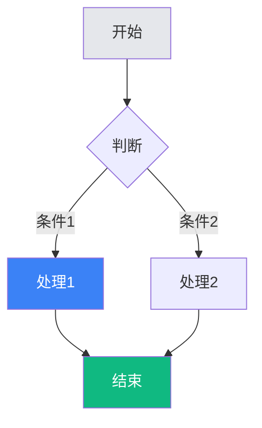
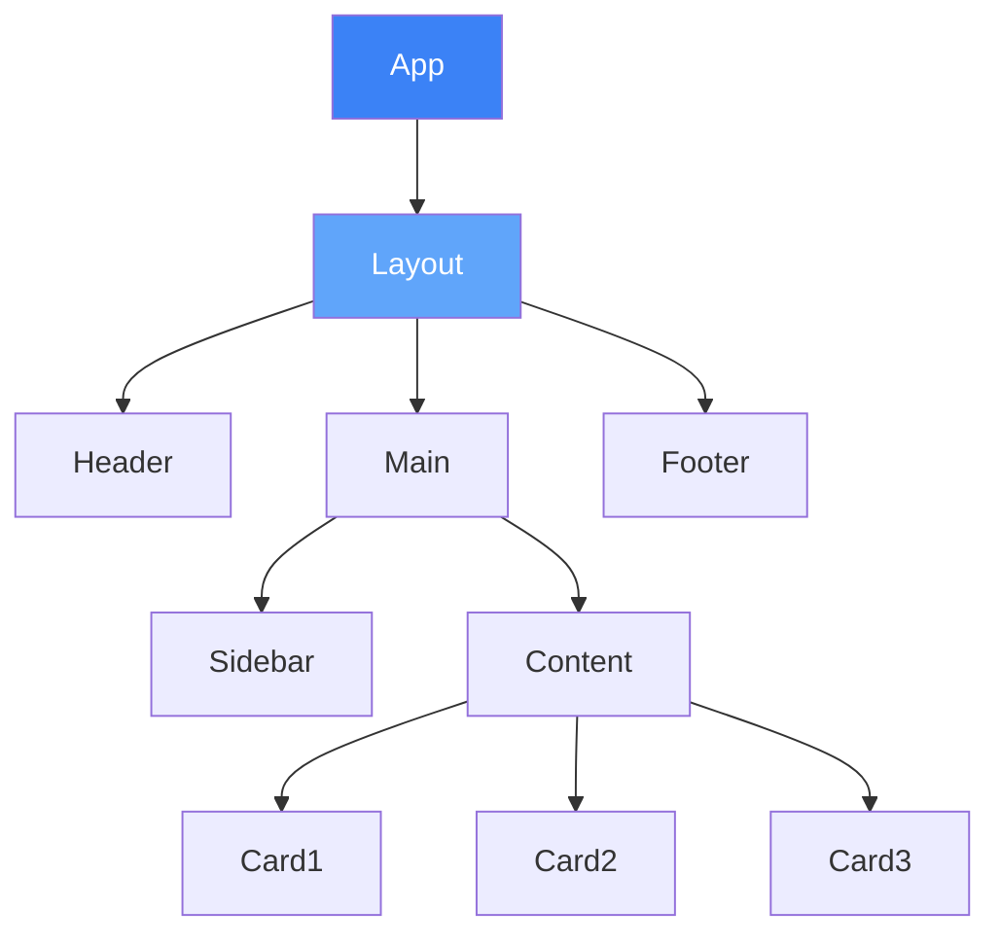
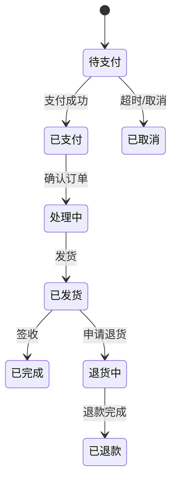
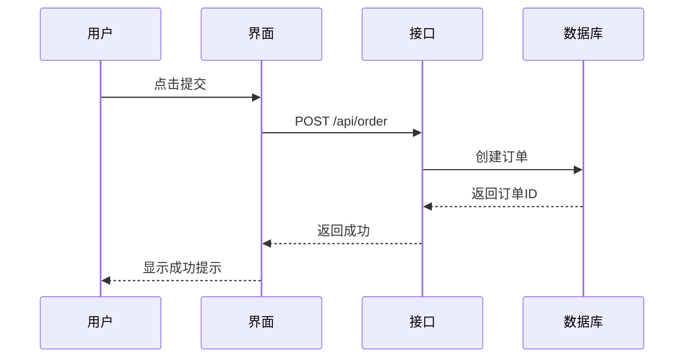
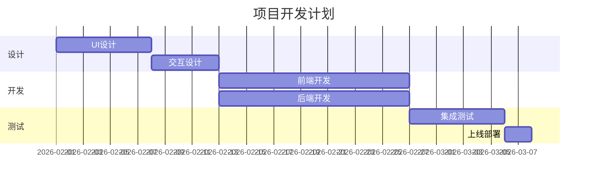

# Markdown 图形绘制规范

## 概述

本规范定义了在Markdown中使用ASCII艺术、Mermaid图表和其他可视化方式绘制UI图形的标准方法。

## ASCII 艺术基础

### 边框字符

```
单线边框: ┌ ┐ └ ┘ ├ ┤ ┬ ┴ ┼ ─ │
双线边框: ╔ ╗ ╚ ╝ ╠ ╣ ╦ ╩ ╬ ═ ║
粗线边框: ┏ ┓ ┗ ┛ ┣ ┫ ┳ ┻ ╋ ━ ┃
```

### 基础图形

#### 矩形

```markdown
单线矩形:
┌─────────────┐
│             │
│   内容区    │
│             │
└─────────────┘

圆角矩形:
╭─────────────╮
│             │
│   内容区    │
│             │
╰─────────────╯

阴影矩形:
┌─────────────┐│
│             ││
│   内容区    │┘
│             ┘
└─────────────┘
```

#### 嵌套结构

```markdown
卡片嵌套:
┌─────────────────────────────┐
│  Card                       │
│  ┌───────────────────────┐  │
│  │  Header               │  │
│  ├───────────────────────┤  │
│  │  ┌─────────────────┐  │  │
│  │  │  Content        │  │  │
│  │  │  ┌───┐ ┌───┐   │  │  │
│  │  │  │ A │ │ B │   │  │  │
│  │  │  └───┘ └───┘   │  │  │
│  │  └─────────────────┘  │  │
│  ├───────────────────────┤  │
│  │  Footer               │  │
│  └───────────────────────┘  │
└─────────────────────────────┘
```

### UI组件绘制

#### 按钮

```markdown
默认按钮:
┌────────────┐
│   提交     │
└────────────┘

圆角按钮:
╭────────────╮
│   提交     │
╰────────────╯

描边按钮:
┌────────────┐
│   取消     │  ← 透明背景
└────────────┘

带图标按钮:
┌────────────────┐
│  +  新建项目   │
└────────────────┘

小按钮:
┌────┐
│  × │
└────┘

按钮组:
┌────────┬────────┬────────┐
│  复制  │  粘贴  │  剪切  │
└────────┴────────┴────────┘
```

#### 输入框

```markdown
文本输入:
┌────────────────────────────┐
│ 请输入用户名               │
└────────────────────────────┘

带标签输入:
用户名
┌────────────────────────────┐
│ user@example.com           │
└────────────────────────────┘

带图标输入:
┌────────────────────────────┐
│ 🔍 搜索...                 │
└────────────────────────────┘

密码输入:
┌────────────────────────────┐
│ ••••••••         [显示]    │
└────────────────────────────┘

错误状态:
┌────────────────────────────┐
│                            │
└────────────────────────────┘
⚠️ 用户名不能为空
```

#### 卡片

```markdown
基础卡片:
┌─────────────────────────────┐
│                             │
│  [图片区域]                 │
│                             │
├─────────────────────────────┤
│  卡片标题                   │
│  卡片描述文字...            │
│                             │
│  [了解更多 →]               │
│                             │
└─────────────────────────────┘

信息卡片:
┌─────────────────────────────┐
│  📊 数据统计                 │
├─────────────────────────────┤
│                             │
│  总用户数      12,345       │
│  ─────────────────────────  │
│  新增用户         +234      │
│  活跃用户       8,901       │
│                             │
└─────────────────────────────┘

用户卡片:
┌─────────────────────────────┐
│  ┌────┐                     │
│  │ 👤 │  张三               │
│  └────┘  产品经理           │
│          zhangsan@corp.com  │
│                             │
│  [发消息]  [查看资料]       │
└─────────────────────────────┘
```

#### 导航

```markdown
顶部导航:
┌─────────────────────────────────────────────────────────────┐
│  LOGO    首页    产品    解决方案    价格    [登录] [注册]   │
└─────────────────────────────────────────────────────────────┘

侧边导航:
┌────────────────┐
│  📊 仪表盘     │
│  📁 项目       │
│  👥 团队       │
│  📈 报表       │
│  ──────────────│
│  ⚙️ 设置       │
└────────────────┘

标签页:
┌────────┬────────┬────────┬────────┐
│  概览  │  详情  │  设置  │  日志  │
├────────┴────────┴────────┴────────┤
│                                   │
│  当前标签页内容                    │
│                                   │
└───────────────────────────────────┘

面包屑:
首页 > 产品管理 > 电子产品 > 手机
```

#### 列表

```markdown
基础列表:
┌─────────────────────────────┐
│  ☐  任务项 1                │
│  ☐  任务项 2                │
│  ☐  任务项 3                │
│  ☐  任务项 4                │
└─────────────────────────────┘

复杂列表项:
┌─────────────────────────────────────────────┐
│  ┌────┐                                     │
│  │ 📄 │  项目文档.pdf          2.3MB  ⋮    │
│  └────┘  修改于 2026-02-15                 │
├─────────────────────────────────────────────┤
│  ┌────┐                                     │
│  │ 📊 │  数据报表.xlsx         1.1MB  ⋮    │
│  └────┘  修改于 2026-02-14                 │
└─────────────────────────────────────────────┘

时间线:
│
●─── 2026-02-16  项目启动
│
○─── 2026-02-15  需求评审
│
○─── 2026-02-14  方案设计
│
```

#### 模态框

```markdown
确认对话框:
┌─────────────────────────────┐
│  确认删除              [×]  │
├─────────────────────────────┤
│                             │
│  ⚠️ 确定要删除这个项目吗？  │
│                             │
│  此操作不可撤销。           │
│                             │
│  [取消]        [确认删除]   │
│                             │
└─────────────────────────────┘

表单对话框:
┌─────────────────────────────┐
│  新建项目              [×]  │
├─────────────────────────────┤
│                             │
│  项目名称                   │
│  ┌───────────────────────┐  │
│  │                       │  │
│  └───────────────────────┘  │
│                             │
│  项目描述                   │
│  ┌───────────────────────┐  │
│  │                       │  │
│  │                       │  │
│  └───────────────────────┘  │
│                             │
│  [取消]            [创建]   │
└─────────────────────────────┘
```

#### 表格

```markdown
数据表格:
┌──────┬────────────┬──────────┬──────────┐
│  ID  │    姓名    │   部门   │   状态   │
├──────┼────────────┼──────────┼──────────┤
│  001 │   张三     │  技术部  │  ● 在职  │
│  002 │   李四     │  产品部  │  ● 在职  │
│  003 │   王五     │  设计部  │  ○ 休假  │
│  004 │   赵六     │  技术部  │  ● 在职  │
└──────┴────────────┴──────────┴──────────┘
分页: [<] 1 / 10 [>]
```

### 页面布局

```markdown
Dashboard布局:
┌─────────────────────────────────────────────────────────────┐
│  LOGO                              通知  消息  [用户 ▼]    │
├──────────────┬──────────────────────────────────────────────┤
│              │  仪表盘                              [刷新]  │
│  📊 仪表盘   ├──────────────────────────────────────────────┤
│  📁 项目     │                                              │
│  👥 团队     │  ┌──────────┐ ┌──────────┐ ┌──────────┐     │
│  📈 报表     │  │  用户    │ │  收入    │ │  订单    │     │
│  ────────────│  │  1,234   │ │  ¥56K    │ │  89      │     │
│  ⚙️ 设置     │  └──────────┘ └──────────┘ └──────────┘     │
│              │                                              │
│              │  ┌──────────────────────────────────────┐   │
│              │  │         数据趋势图表                  │   │
│              │  │                                      │   │
│              │  │    /\      /\                        │   │
│              │  │   /  \    /  \      /\               │   │
│              │  │  /    \  /    \    /  \              │   │
│              │  │ /      \/      \  /    \/\          │   │
│              │  └──────────────────────────────────────┘   │
│              │                                              │
└──────────────┴──────────────────────────────────────────────┘
```

## Mermaid 图表规范

### 流程图

```markdown

```

### 组件树

```markdown

```

### 状态机

```markdown

```

### 时序图

```markdown

```

### 甘特图

```markdown

```

## 颜色表示

```markdown
颜色块表示:
🔴 红色 (#EF4444) - 错误、警告
🟠 橙色 (#F97316) - 提醒、注意
🟡 黄色 (#EAB308) - 提示、高亮
🟢 绿色 (#22C55E) - 成功、通过
🔵 蓝色 (#3B82F6) - 主色、信息
🟣 紫色 (#A855F7) - 特殊、VIP
⚫ 黑色 (#000000) - 文字、边框
⚪ 白色 (#FFFFFF) - 背景

灰度:
⬛ #111827 (Gray-900)
⬛ #374151 (Gray-700)
⬛ #6B7280 (Gray-500)
⬛ #9CA3AF (Gray-400)
⬜ #D1D5DB (Gray-300)
⬜ #F3F4F6 (Gray-100)
```

## 图标符号

```markdown
通用图标:
👤 用户    🔔 通知    ⚙️ 设置    🔍 搜索
🏠 首页    📊 图表    📁 文件夹  📄 文档
✉️ 邮件    💬 消息    ❤️ 收藏    ⭐ 评分
⚠️ 警告    ✅ 成功    ❌ 错误    ❓ 帮助
🔄 刷新    ➕ 添加    ✏️ 编辑    🗑️ 删除
📅 日历    ⏰ 时间    🔗 链接    📎 附件

状态指示:
● 在线/启用    ○ 离线/禁用    ◐ 忙碌/警告
▶ 播放    ⏸ 暂停    ⏹ 停止
◀ 上一页    ▶ 下一页    ▲ 向上    ▼ 向下
```

## 最佳实践

1. **保持简洁**: ASCII图宽度控制在80字符以内
2. **使用等宽字体**: 确保对齐正确
3. **注释说明**: 复杂图形添加文字注释
4. **版本兼容**: 优先使用基础ASCII字符
5. **响应式考虑**: 复杂布局用Mermaid替代
6. **颜色一致**: 使用统一的颜色语义
7. **状态完整**: 展示所有交互状态
